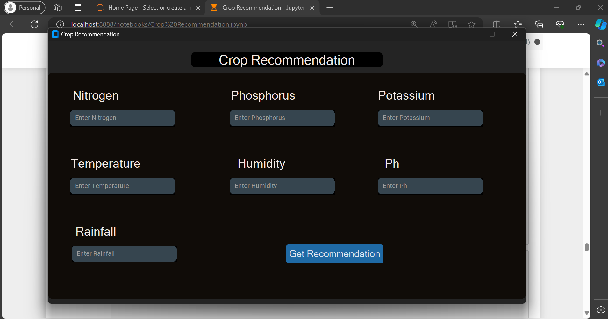
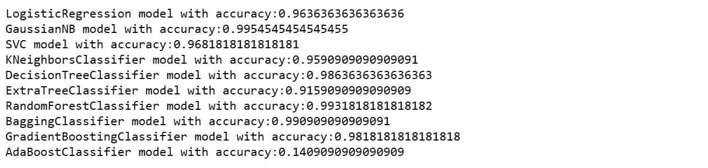

# Crop-Recommendation Using Various classifications 🌾 🌱 
This project implements a crop recommendation system using various classification algorithms
to predict the suitable crop for a given set of environmental parameters.

Agriculture plays a vital role in the economy, and predicting the best crop to cultivate based on environmental factors such as temperature, humidity, pH, and rainfall can significantly impact agricultural yield and profitability. This project aims to assist farmers in making informed decisions about crop selection.

## Dataset 📊

The crop recommendation system is trained on a dataset containing environmental parameters and corresponding crop labels. The dataset includes features such as Nitrogen (N), Phosphorus (P), Potassium (K), temperature, humidity, pH, and rainfall.
You can find the dataset on Kaggle: [Crop Recommendation Dataset]([https://www.kaggle.com/yourusername/crop-recommendation-dataset](https://www.kaggle.com/datasets/atharvaingle/crop-recommendation-dataset))

## Classification Models 

The following classification models were implemented and evaluated for predicting the suitable crop:

- Logistic Regression
- Gaussian Naive Bayes
- Support Vector Classifier (SVC)
- K-Nearest Neighbors (KNN)
- Decision Tree
- Extra Tree
- Random Forest
- Bagging Classifier
- Gradient Boosting
- AdaBoost

## Model Evaluation 🔍

Each model was evaluated using cross-validation and assessed based on accuracy. The model with the highest accuracy was selected for crop prediction.

- Logistic Regression model with accuracy: 96.36%
- Gaussian Naive Bayes model with accuracy: 99.55%
- Support Vector Classifier (SVC) model with accuracy: 96.82%
- K-Nearest Neighbors (KNN) model with accuracy: 95.91%
- Decision Tree model with accuracy: 98.64%
- Extra Tree model with accuracy: 91.59%
- Random Forest model with accuracy: 99.92%
- Bagging Classifier model with accuracy: 99.09%
- Gradient Boosting model with accuracy: 98.18%
- AdaBoost model with accuracy: 14.09%

  

## Conclusion

Based on the evaluation results, the Random Forest model achieved the highest accuracy and was selected for crop prediction in the recommendation system. Further optimizations and improvements can be made to enhance the accuracy and robustness of the model.
